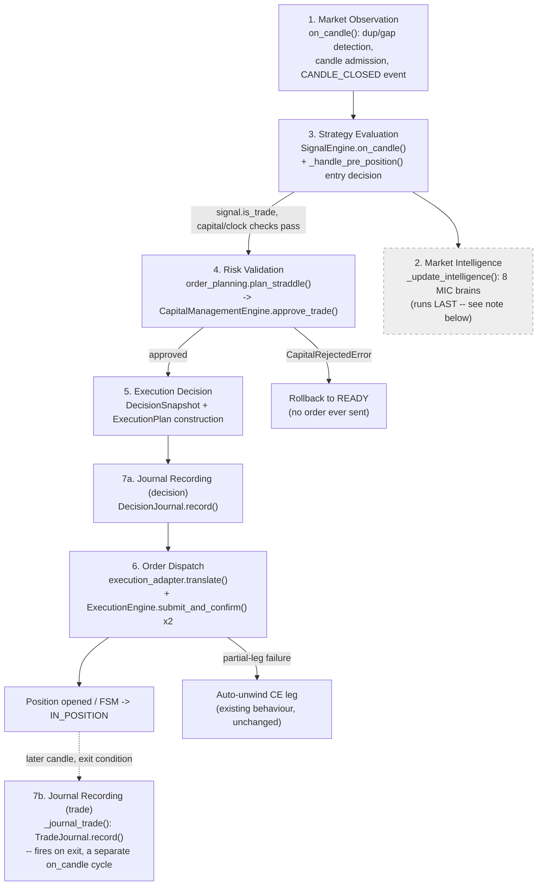

# Decision Pipeline — Stage Documentation

Production Engineering Sprint 1 (Decision Pipeline Refactor, Zero
Behavioural Change). This document maps the seven requested pipeline
stages onto the **existing** code in `bujji/core/orchestrator.py` —
every line of trading logic is untouched; only `with stage(...):`
observability wrappers were added (`bujji/core/pipeline_stages.py`).

## Architecture diagram

## Stage-by-stage mapping

| # | Stage | Existing code | `stage()` name |
|---|---|---|---|
| 1 | Market Observation | `Orchestrator.on_candle()` — duplicate/stale detection, gap detection, `_last_candle_ts`/`_spot_candle_history` update, `CANDLE_CLOSED` publish | `market_observation` |
| 2 | Market Intelligence | `Orchestrator._update_intelligence()` — the 8 MIC brains (Regime/Volatility/Premium/Greeks/Liquidity/Structure/Event/Behaviour) | `market_intelligence` |
| 3 | Strategy Evaluation | `SignalEngine.on_candle()` (Module 1: VWAP/ORB) + `Orchestrator._handle_pre_position()`'s trade-worthiness/clock/max-trades checks and `TradeIntention` construction | `strategy_evaluation` |
| 4 | Risk Validation | `order_planning.plan_straddle()` → `CapitalManagementEngine.approve_trade()` | `risk_validation` |
| 5 | Execution Decision | `DecisionSnapshot` + `ExecutionPlan` construction in `Orchestrator._enter()` | `execution_decision` |
| 6 | Order Dispatch | `execution_adapter.translate()` + two `ExecutionEngine.submit_and_confirm()` calls (CE, PE legs), including the existing partial-leg auto-unwind path | `order_dispatch` |
| 7 | Journal Recording | `DecisionJournal.record()` (decision half, in `_enter()`) and `TradeJournal.record()` via `_journal_trade()` (trade half, on exit) | `journal_recording_decision` / `journal_recording_trade` |

## Important architectural note: Stage 2 does not run where the numbered list implies

The requested ordering is `Market Observation → Market Intelligence →
Strategy Evaluation → ...`. The **existing, pre-refactor** code runs
Market Intelligence (`_update_intelligence()`) **after** Strategy
Evaluation and Execution Decision have already completed for that
candle — a fact confirmed by reading `on_candle()`'s original body,
which calls `_update_intelligence(candle)` as its last line, with an
explicit prior comment: *"Audit runs LAST and reads state only — never
affects trading logic."*

This sprint's non-negotiable rule is **zero behavioural change** — so
this ordering was **not** altered to match the requested diagram. The
stage documentation and Mermaid diagram above record this honestly (the
Market Intelligence box is dashed, with a note) rather than silently
reordering production code to match an idealized stage list, which
would itself be a behavioural change and a regression by this sprint's
own success criteria. Reordering Market Intelligence to run before
Strategy Evaluation is a legitimate future sprint, but it is a strategy-
adjacent, decision-input change — explicitly out of scope here ("Do not
alter trading decisions").

## Observability contract

Every stage, via `bujji/core/pipeline_stages.py::stage()`, emits:

- `pipeline_stage_start` — `stage`, plus stage-specific context (e.g. `candle_ts`, `decision_id`).
- `pipeline_stage_finish` — `stage`, `outcome` (`"ok"` or `"error"`), `duration_ms`, and `failure_reason` when `outcome="error"`.

The context manager never suppresses an exception — on error it logs
`pipeline_stage_finish` with `outcome="error"` and then re-raises the
*exact same* exception object, so every pre-existing `try/except` in
`orchestrator.py` (auth errors, execution errors, capital rejection,
contract-resolution failures) observes identical behaviour to before
this sprint.
